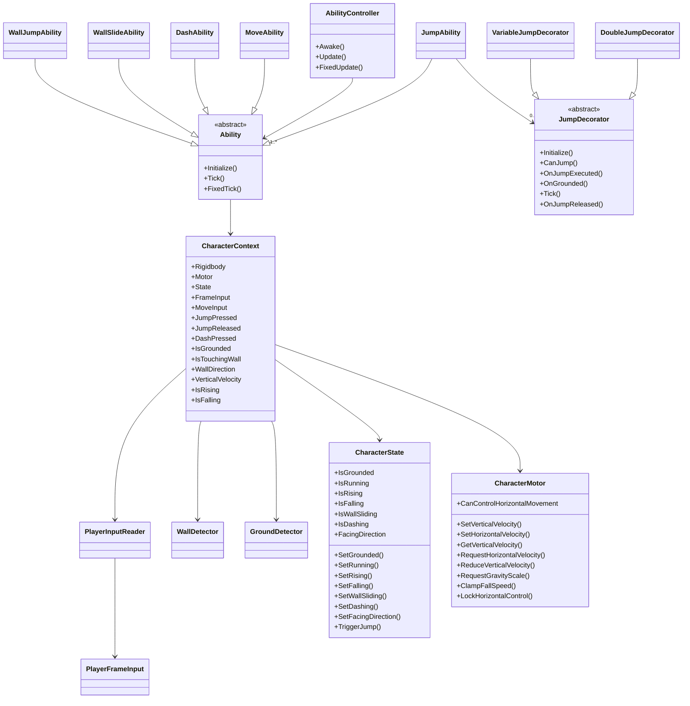

# Arquitetura do projeto

## Objetivo da arquitetura

A arquitetura atual foi pensada para sustentar um gameplay de plataforma 2D com foco em extensibilidade. O personagem é tratado como um conjunto de módulos pequenos e reutilizáveis: entrada, estado, movimento físico, detecção de ambiente e habilidades específicas.

O padrão central é:
- cada feature deve ter uma responsabilidade única;
- o fluxo de dados passa pelo CharacterContext;
- habilidades novas devem ser adicionadas como novas classes sem exigir mudanças nas classes já existentes;
- componentes físicos e de detecção ficam isolados em módulos de core.

## Estrutura atual das pastas

```text
Assets/Game/Scripts/
├── Abilities/
│   ├── Ability.cs
│   ├── Jump/
│   │   ├── JumpAbility.cs
│   │   ├── JumpDecorator.cs
│   │   ├── DoubleJumpDecorator.cs
│   │   └── VariableJumpDecorator.cs
│   ├── Movement/
│   │   └── MoveAbility.cs
│   ├── Dash/
│   │   └── DashAbility.cs
│   └── Wall/
│       ├── WallSlideAbility.cs
│       └── WallJumpAbility.cs
├── Core/
│   ├── AbilityController.cs
│   ├── CharacterContext.cs
│   ├── CharacterMotor.cs
│   ├── CharacterState.cs
│   ├── GroundDetector.cs
│   ├── PlayerInputActions.cs
│   ├── PlayerInputReader.cs
│   ├── WallDetector.cs
│   └── MotorPriority.cs
├── Components/
├── Data/
├── Intefaces/
│   └── IAbility.cs
└── Specs/
    ├── achitecture.md
    └── classes-specs.md
```

## Regras de design

1. Nenhuma feature nova deve exigir alteração em outra feature já existente.
2. Toda nova habilidade deve herdar de Ability ou, quando necessário, ampliar a lógica por meio de decoradores.
3. O acesso aos dados do personagem deve passar por CharacterContext.
4. Lógica física básica deve ficar em CharacterMotor, GroundDetector e WallDetector.
5. Inputs devem ser lidos em PlayerInputReader e consumidos pelo contexto.
6. Estado de gameplay deve ser centralizado em CharacterState.
7. Novos sistemas, como itens, inimigos e traps, devem expor eventos e estado sem acoplar diretamente a outras classes.

## Responsabilidades por camada

### Core
- AbilityController: encontra todas as habilidades no GameObject e as executa nos ciclos de vida do Unity.
- CharacterContext: centraliza acesso a Rigidbody2D, CharacterMotor, GroundDetector, WallDetector, input e estado do personagem.
- CharacterMotor: encapsula movimentação física básica, velocidade horizontal/vertical e transições simples de estado.
- GroundDetector: verifica contato com o chão usando overlap circle e camada específica.
- WallDetector: verifica contato com paredes para habilidades de interação lateral.
- PlayerInputReader: traduz inputs do Input System para eventos simples consumíveis.
- CharacterState: concentra os estados contínuos e eventos do personagem.

### Abilities
- Ability: classe base para o ciclo de vida das habilidades.
- MoveAbility: controla movimento horizontal.
- JumpAbility: controla pulo, coyote time e jump buffer.
- JumpDecorator: base para extensões do comportamento de salto.
- DoubleJumpDecorator: adiciona salto extra sem mexer na lógica base de JumpAbility.
- DashAbility, WallSlideAbility e WallJumpAbility: implementam interações específicas do personagem.

## Padrão para implementar uma nova feature

### 1. Definir a responsabilidade
- A feature deve ter uma única função clara e bem delimitada.
- Ela não deve assumir responsabilidades de outra feature já existente.

### 2. Criar a classe do módulo
- Criar um novo arquivo em uma pasta apropriada dentro de Abilities, Core ou Components.
- Se for uma habilidade, herdar de Ability.
- Se for um sistema de estado, preferir um componente próprio com integração via CharacterContext.

### 3. Usar o contexto, não componentes diretamente
- O módulo deve acessar o personagem por meio de CharacterContext.
- Exemplo: usar Context.MoveInput, Context.IsGrounded, Context.Motor e Context.State.
- Restrição: não invocar diretamente Rigidbody2D, Input System ou lógica de outra feature no módulo.

### 4. Respeitar o ciclo de vida
- O AbilityController já chama Initialize() no Awake, Tick() no Update e FixedTick() no FixedUpdate.
- A feature não precisa se registrar manualmente.
- Restrição: não modificar o AbilityController para cada nova habilidade.

### 5. Isolar efeitos físicos e estado
- Movimento, salto, detecção de chão e parede devem permanecer encapsulados em módulos de Core.
- Se a feature precisar de estado próprio, ele deve ficar dentro da própria classe ou em um componente dedicado.

### 6. Considerar extensibilidade
- Se a feature for uma variação de outra, prefira decoradores ou composição em vez de alterar a implementação principal.
- Restrição: não alterar a lógica base de JumpAbility para adicionar Double Jump, Dash ou Wall Slide.

### 7. Validar e testar no cenário
- Confirmar que a feature funciona com o personagem já existente.
- Garantir que não interrompe movimentação, pulo, detecção de chão ou parede.

## Passo a passo para implementar uma nova habilidade

1. Definir o comportamento desejado e o gatilho de entrada.
2. Criar uma nova classe em Abilities com responsabilidade única.
3. Implementar Initialize(), Tick() e/ou FixedTick().
4. Ler o estado do personagem via CharacterContext e publicar mudanças em CharacterState.
5. Se a habilidade for uma variação de outra, usar decoradores ou composição.
6. Adicionar os ajustes necessários de animação, áudio e VFX via eventos do CharacterState.

## Passo a passo para implementar um novo item coletável

1. Criar um componente dedicado para o item em Components ou Data.
2. Definir seu efeito em uma classe específica, como CollectibleEffect.
3. Detectar a interação com o jogador via trigger ou overlap.
4. Disparar um evento de coleta e atualizar o estado de inventário ou HUD.
5. Encapsular o efeito em uma lógica reutilizável e não misturar com a física do personagem.

## Passo a passo para implementar um novo inimigo

1. Criar um componente de inimigo com estado próprio e referências ao CharacterContext quando necessário.
2. Separar comportamento de IA, dano e movimentação em módulos distintos.
3. Usar detecção de colisão e eventos para comunicar dano e morte.
4. Publicar estados de ataque, perseguição ou idle por meio de um componente de estado próprio.
5. Evitar acoplar o inimigo diretamente à lógica do jogador.

## Passo a passo para implementar uma trap

1. Criar um componente de trigger ou detector para a trap.
2. Definir se a trap causa dano, impulso, slow ou alteração de estado.
3. Aplicar o efeito por meio de uma classe dedicada e não dentro do próprio objeto visual.
4. Expor eventos de ativação para efeitos de áudio, animação e feedback visual.
5. Garantir que a trap não tenha responsabilidade de controlar o personagem diretamente.

## Diagrama de classes simplificado



## Resumo da regra de extensão

A arquitetura foi pensada para permitir crescimento sem acoplamento excessivo. Cada nova feature deve ser adicionada como uma nova classe ou componente com responsabilidade local, acessando o restante do sistema por meio de CharacterContext, CharacterState e das APIs já existentes.